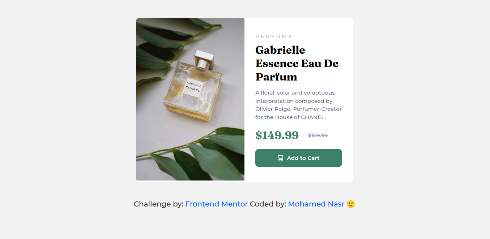
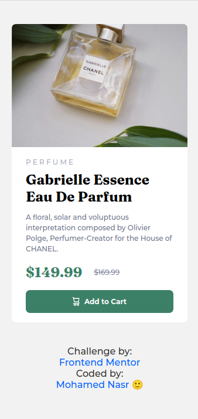

# Frontend Mentor - Product preview card component solution

This is a solution to the [Product preview card component challenge on Frontend Mentor](https://www.frontendmentor.io/challenges/product-preview-card-component-GO7UmttRfa). Frontend Mentor challenges help you improve your coding skills by building realistic projects. 

## Table of contents

- [Overview](#overview)
  - [The challenge](#the-challenge)
  - [Screenshot](#screenshot)
  - [Links](#links)
- [My process](#my-process)
  - [Built with](#built-with)
  - [What I learned](#what-i-learned)
  - [Continued development](#continued-development)
  - [Useful resources](#useful-resources)
- [Author](#author)
- [Acknowledgments](#acknowledgments)


## Overview

### The challenge

Users should be able to:

- View the optimal layout depending on their device's screen size
- See hover and focus states for interactive elements

### Screenshot




### Links


- Solution URL: [GitHub](https://github.com/monasr1997/product-preview-card-component-main/)
- Live Site URL: [live site URL ](https://product-preview-card-component-main-001.netlify.app/)

## My process

### Built with

- Semantic HTML5 markup
- CSS custom properties
- Flexbox
- CSS Grid
- Mobile-first workflow

### What I learned

- Use `<picture>` element to to offer alternative versions of an image for different display/device scenarios.

 ```html
        <picture>
          <source
            srcset="./images/image-product-desktop.jpg"
            media="(min-width:1440px)"
          />
          
        </picture>
  ````


### Useful resources

- [<picture>: The Picture element - HTML: HyperText Markup Language | MDN](https://developer.mozilla.org/en-US/docs/Web/HTML/Element/picture)

## Author

- Website - [Mohamed Nasr](https://linkedin.com/in/monasr1997)
- Frontend Mentor - [@monasr1997](https://www.frontendmentor.io/profile/monasr1997)
- Twitter - [@monasr1997](https://www.twitter.com/monasr1997)

